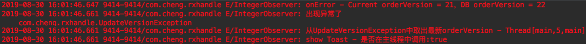

# RxHandleException
RxJava handle business exception practice.

# 背景

先来看一下有这样一个需求：客户端上点击某按钮后需要调用多个Http服务才能完成该项操作，如下图：


这里有几个细节：
- 上图三个接口串连，并且第二个接口依赖第一个接口的返回值，第三个接口依赖第二个接口的返回值
- 上述三个接口调用都会导致服务端更新订单（orderVersion变化）
- 接口请求参数中的orderVersion如果与服务端不一致将导致异常，客户端收到订单版本已变更

在RxJava中要组合/串连多个网络接口很简单，这没什么好说的。这里要介绍的是在开发过程中可能容易忽略的多个串连接口其中某个失败的异常处理情况。

对于上述情况出现的异常可以分两种情况：

1.  无论哪个接口正常或异常都不影响客户端所用数据源，也就是客户端不需要根据接口返回值或异常修改本地数据源，只需按常规的方式捕获异常，提示用户即可
2.  无论哪个接口正常或异常都会影响客户端所用数据源，客户端不能按常规方式处理异常

第一种情况处理比较简单，不是本篇讨论的主题，这里要讨论的是第二种情况。
PS：这里先贴上源码，跑一下demo，一目了然
[https://github.com/DIY-green/RxHandleException](https://github.com/DIY-green/RxHandleException "https://github.com/DIY-green/RxHandleException")

# 异常现象
背景清楚了，来看一下第二种情况下客户端未对异常做特殊处理时的现象。


解释一下上图。

首先来看第一次请求，在客户端用户操作结账，于是发起[下单 → 预结账 → 结账]请求，由于当前用户所使用账号没有结账（包括预结账）权限，所以预结账失败，抛出异常，提示没有权限。到这里为止没有问题，客户端正确提示用户，当前使用账号没有权限，无法结账（请不要纠结接口名称和为什么需要客户端串连调用多个接口这些问题）。

说明：关于账号没有权限在移动App上常见于B端产品，没有接触过的同学就简单当做普通用户和root用户来理解，普通用户有很多操作是没有权限执行的。

下面看第二次请求，按照正常的逻辑来理解，这里应该和第一次请求一样（如果把下单过程理解为一个事务，那么就应该是这样），因为不管中途哪个环节失败了，整个流程就失败了（事务失败了，应该回滚），下次再请求应该和上次没有区别。

但是，在我们的系统中往往如上图所示，第二次请求，直接在第一个接口处校验订单版本号就失败了，这是不符合预期的。

简单小结一下：当客户端串连调用多个接口，并且需要关心接口返回值（需将返回值同步到本地数据源供以后的请求使用）这种情形下，如果某个接口调用失败，导致下一次请求会出现非预期的异常（和第一次的异常不同）。这种情况是由于客户端未将接口调用失败前的请求数据同步到本地数据源导致的。

# 准备数据

上面只是简单介绍了需求（背景）和异常现象，下面将使用一个简单的示例来模拟这些情况，首先是数据准备。

我们先来定义一些常用的类，这里只是模拟一个B端的下单业务场景，主要为了演示上述现象，请忽略不符合业务设计的地方。

先来看看服务端提供的接口部分，这里仿照Retrofit的ApiService的写法，定义了一个NetApi类：
```java
/**
 * @author liwangcheng
 * @date 2019-08-30 06:43.
 */
public class NetApi {
	// 假设这是服务端数据库中的订单版本号信息
    public static int sOrderVersion = 0;
    /**
     * 返回Observable的接口
     * @param order
     * @return
     */
    public Observable<Integer> verify(final Order order) {
        return Observable.create(new ObservableOnSubscribe<Integer>() {
            @Override
            public void subscribe(ObservableEmitter<Integer> observer) throws Exception {
                if (checkOrderVersion(observer, order)) {
                    return;
                }
                int orderVersion = order.orderVersion + 1;
                sOrderVersion = orderVersion;
                SystemClock.sleep(1000);
                observer.onNext(orderVersion);
            }
        });
    }
    /**
     * 同步调用接口
     * @param order
     * @return
     */
	...
    private boolean checkOrderVersion(ObservableEmitter<Integer> observer, Order order) {
        if (order.orderVersion != sOrderVersion) {
            observer.onError(new ApiException(101, "订单版本已变更"));
            return true;
        }
        return false;
    }
    private void checkOrderVersion(Order order) throws ApiException {
        if (order.orderVersion != sOrderVersion) {
            throw new ApiException(101, "订单版本已变更");
        }
    }
}
```

在NetApi中定义了返回Observable的接口和对应的同步调用接口，供下面使用，代码很简单，不多解释。
上面代码中已经出现ApiException了，一般项目中都会定义一个通用业务异常，代码如下：

```java
/**
 * @author liwangcheng
 * @date 2019-08-30 06:47.
 */
public class ApiException extends Exception {
    public int errorCode;
    public String errorMsg;
	...
}
```

就是一个普通的自定义异常，封装了errorCode和errorMsg供业务方使用。
这里再定义一个订单类：
```java
/**
 * @author liwangcheng
 * @date 2019-08-30 06:44.
 */
public class Order {
    public int orderVersion;
    public String orderId;
	...
}
```

再就是定义了一个统一的Observer（IntegerObserver.java）当做调用方的回调，主要代码如下，其中的onError部分逻辑后面会介绍：

```java
/**
 * @author liwangcheng
 * @date 2019-08-30 07:19.
 */
public class IntegerObserver implements Observer<Integer> {
  	...
    @Override
    public void onNext(Integer orderVersion) {
        Log.e(TAG, "onNext - Current orderVersion = " + orderVersion + "，DB orderVersion = " + NetApi.sOrderVersion);
        toast("操作成功，更新订单号 - " + orderVersion);
    }
    @Override
    public void onError(Throwable e) {
        Log.e(TAG, "onError - Current orderVersion = " + mOrder.orderVersion + "，DB orderVersion = " + NetApi.sOrderVersion);
        Log.e(TAG, "出现异常了", e);
        if (e instanceof UpdateVersionException) {
            Log.e(TAG, "从UpdateVersionException中取出最新orderVersion - " + Thread.currentThread());
            updateOrderVersion(((UpdateVersionException) e).orderVersion);
            toast(((UpdateVersionException) e).errorMsg);
        } else if (e instanceof ApiException) {
            toast(((ApiException) e).errorMsg);
        } else {
            toast("未知异常");
        }
    }
	...
    private void updateOrderVersion(int orderVersion) {
        mOrder.orderVersion = orderVersion;
    }
}
```

好了，前期需要的准备工作基本完成，下面我们思考一下有哪些方案可以解决上述非期望问题。

下面将列出笔者想到的解决方案，并一一解析这其中踩过的坑。

# 方案一：在doOnError中转换为自定义异常

该方案是这样的利用RxJava的doOnError操作符，在执行Observer的onError之前做一些操作，这里采用自定义异常的方式将信息带入，然后交给Observer的onError，这样调用方就可以感知到数据更新。方案一的代码见：Solution1.java文件。

## 先来看第一个坑——就是没做任何处理的情况：

测试代码如下：

```java
/**
  * 中间某个接口失败，接收到异常了，但是orderVersion更新丢失了
  */
public void testPit1(Observer<Integer> observer) {
  mNetApi.verify(mOrder)
    .flatMap(new Function<Integer, ObservableSource<Integer>>() {
      @Override
      public ObservableSource<Integer> apply(Integer orderVersion) throws Exception {
        updateOrderVersion(orderVersion);
        return mNetApi.prePay(mOrder);
      }
    })
    .flatMap(new Function<Integer, ObservableSource<Integer>>() {
      @Override
      public ObservableSource<Integer> apply(Integer orderVersion) throws Exception {
        updateOrderVersion(orderVersion);
        return mNetApi.pay(mOrder);
      }
    })
    .subscribeOn(Schedulers.io())
    .observeOn(AndroidSchedulers.mainThread())
    .subscribe(observer);
}
```

这用flatMap串连多个接口，这个不用多说，下面的代码类似。
第一次请求输出日志：


这是第一次调用情况，某个接口没有权限失败了，符合预期。
再请求一次试试：


好了，在第一个接口处就直接被订单版本号校验拦住了，也就是上面介绍的第二次请求的非期望现象（期望现象是，这里还是提示权限异常，出现订单版本已变更是因为客户端数据源没有更新导致的）。

## 插播：IntegerObserver#onError

```java
if (e instanceof UpdateVersionException) {
  Log.e(TAG, "从UpdateVersionException中取出最新orderVersion - " + Thread.currentThread());
  updateOrderVersion(((UpdateVersionException) e).orderVersion);
  toast(((UpdateVersionException) e).errorMsg);
} else if (e instanceof ApiException) {
  toast(((ApiException) e).errorMsg);
} else {
  toast("未知异常");
}
```

上面是IntegerObserver#onError的主要代码，简单介绍一下。

在该方法中通过判断参数Throwable是否为自定义异常做了不同处理，首先是UpdateVersionException时，需要从该自定义异常中取出所携带的orderVersion，并更新调用方的数据，这样就可以将串连接口中更新orderVersion的信息同步到调用方的数据源。然后是ApiException，这里模拟的是按常规方式对业务异常做的处理。

实现比较简单，不再啰嗦。

## 第二个坑——doOnError中抛出自定义异常：

思路是这样的，通过自定义异常（UpdateVersionException）的方式将串连调用过程中更新的orderVersion信息封装到该异常中，然后在onError调用之前将其他接口抛出的异常转换为自定义异常，这样就可以在onError中通过捕获自定义异常获取更新后的orderVersion（期望是这样）。下面是测试代码：

```java
/**
  * 中间某个接口失败，在doOnError中抛出UpdateVersionException包裹orderVersion，
  * 希望调用方捕获该异常，但是异常被转换了，orderVersion信息丢失
  */
public void testPit2(Observer<Integer> observer) {
  mNetApi.verify(mOrder)
    ...
    .doOnError(new Consumer<Throwable>() {
      @Override
      public void accept(Throwable throwable) throws Exception {
        int orderVersion = getLatestOrderVersion();
        // 直接抛出转换异常
        throw new UpdateVersionException(orderVersion, throwable);
      }
    })
    .subscribeOn(Schedulers.io())
    .observeOn(AndroidSchedulers.mainThread())
    .subscribe(observer);
}
```
第一次调用与第一个“坑”的输出一样这里不再重复，直接看第二次调用的输出日志：


这里输出的异常信息比较长，截图做了截取。我们看到上述代码明明只是（在doOnError中）抛出了一个UpdateVersionException，异常堆栈信息却输出了这么一大堆。先看一下UpdateVersionException的定义，代码如下：

```java
/**
 * @author liwangcheng
 * @date 2019-08-30 07:04.
 */
public class UpdateVersionException extends ApiException {
    public int orderVersion;
    public UpdateVersionException(int errorCode, String message) {
        super(errorCode, message);
        orderVersion = errorCode;
        errorMsg = message;
    }
    public UpdateVersionException(int errorCode, Throwable tr) {
        super(errorCode);
        orderVersion = errorCode;
        if (tr instanceof ApiException) {
            errorMsg = ((ApiException) tr).errorMsg;
        }
    }
}
```

这里有一个有意思的现象——doOnError中直接抛异常没有按我们的期望那样，而是被转换了。由于篇幅所限，而且与主题关系不大，这个问题不在这里展开了。

**结论**：这个“坑”就是doOnError中直接抛出自定义异常，在Observer的onError中并不能接收到该异常，从而导致你封装在异常中的信息丢失了（倒不是真正丢失，这里不要较真）。

## 第三个坑——doOnError中直接调Observer#onError可能不是目标线程执行

好了，在doOnError中抛异常你给转换了，那么不抛，直接调Observer#onError总该可以了吧，来试试：

```java
/**
  * doOnError 受 subscribeOn/observerOn 影响，调用线程不确定
  * 可能导致 observer.onError 在非目标线程调用
  */
public void testPit3(final Observer<Integer> observer) {
  mNetApi.verify(mOrder)
    ...
    .doOnError(new Consumer<Throwable>() {
      @Override
      public void accept(Throwable throwable) throws Exception {
        int orderVersion = getLatestOrderVersion();
        observer.onError(new UpdateVersionException(orderVersion, throwable));
      }
    })// 防止onError多次调用
    .onExceptionResumeNext(new ObservableSource<Integer>() {
      @Override
      public void subscribe(Observer<? super Integer> observer) {
      }
    })
    .subscribeOn(Schedulers.io())
    .observeOn(AndroidSchedulers.mainThread())
    .subscribe(observer);
}
```

第二次调用输出日志：


注意，我们做线程切换一般希望Observer#onNext/onComplete/onError在observerOn指定的线程中调用。上面的测试代码由于没有注意doOnError会subscribeOn/observerOn影响，可以看到Observer#onError并没有在observerOn指定的线程中执行，这就有可能导致调用方出现Crash（比如调用方在onError中show了Toast或者Dialog或者其他更新UI的行为），这是不希望看到的。

**结论**：注意doOnError会subscribeOn/observerOn影响

你可能会说，那我把doOnError放到subscribeOn和observerOn之间不就行了。这样做没问题，但是再考虑一个问题，如果需要在doOnError中做耗时操作呢，又去重新开线程？

## 解决——doOnError中调Observer#onError并指定目标线程
直接上代码：

```java
/**
  * 在doOnError中主动切换线程保证 observer.onError 在目标线程调用
  */
public void fillPit(final Observer<Integer> observer) {
  mNetApi.verify(mOrder)
    ...
    .doOnError(new Consumer<Throwable>() {
      @Override
      public void accept(final Throwable throwable) throws Exception {
        final int orderVersion = getLatestOrderVersion();
        // 指定subscribeOn为目标线程，确保Observer#onError在目标线程中调用
        Observable.just(0).subscribeOn(AndroidSchedulers.mainThread()).subscribe(new Consumer<Integer>() {
          @Override
          public void accept(Integer i) throws Exception {
            observer.onError(new UpdateVersionException(orderVersion, throwable));
          }
        });
      }
    }) // 又一坑：防止onError多次调用
    .onExceptionResumeNext(new ObservableSource<Integer>() {
      @Override
      public void subscribe(Observer<? super Integer> observer) {
      }
    })
    .subscribeOn(Schedulers.io())
    .observeOn(AndroidSchedulers.mainThread())
    .subscribe(observer);
}
```
第二次调用日志输出：


到这里完全符合预期了。

好了，自定义异常按照预期交给了Observer#onError，并且是在目标线程中调用的，还有一个坑，这里没“挖”，但是需要注意一下，就是在doOnError中掉完Observer#onError之后，下面最好加上onExceptionResumeNext来防止onError被多次调用。

**小结一下**：
方案一是在doOnError中捕获异常后转换为自定义异常，将orderVersion信息封装到该异常中，然后调用Observer#onError的方式将自定义异常传递给调用方，注意doOnError会受到subscribeOn/observerOn的影响，为避免出现在非预期现象，最好主动切换线程，让Observer#onError在目标线程中执行。

# 方案二：onExceptionResumeNext中“消化”异常

第一个坑——同方案一。

## 第二个坑——在onExceptionResumeNext中转化异常

思路是这样的，在onExceptionResumeNext中生成自定义异常，然后直接调用Observer#onError。

```java
/**
  * 在onExceptionResumeNext中转化异常，由于没有原异常信息，导致原异常丢失
  */
public void testPit2(Observer<Integer> observer) {
  mNetApi.verify(mOrder)
    ...
    .onExceptionResumeNext(new ObservableSource<Integer>() {
      @Override
      public void subscribe(Observer<? super Integer> observer) {
        int orderVersion = getLatestOrderVersion();
        // 定义自定义异常，原异常信息丢失
        observer.onError(new UpdateVersionException(orderVersion, "订单结账异常"));
      }
    })
    .subscribeOn(Schedulers.io())
    .observeOn(AndroidSchedulers.mainThread())
    .subscribe(observer);
}
```

这里只是一个演示，本质也是通过自定义异常封装更新后的orderVersion，然后交给调用方，这个“坑”一目了然，原异常信息丢失了，这个很简单，不再赘述。

## 第三个坑——在onExceptionResumeNext将失败信息封到返回结果

在用C语言编程中一般用函数的返回值（Code）来标记结果状态，比如0表示正常，1表示计算错误等等。在Java中也可以采用这种思路，一个方法调用只能返回一个值，要返回多个怎么办？简单的做法是把这多个返回值封装到一个对象中。这里的思路类似，orderVersion可以看成一个返回值，最后串连调用成功失败是第二个返回值，失败提示信息/异常是第三个返回值，封装为对象Result，代码如下：

```java
/**
 * @author liwangcheng
 * @date 2019-08-30 08:23.
 */
public class Result<T> {
    public boolean succeed;
    public T result;
    public ApiException exception;
    ...
}
```

测试代码：

```java
/**
  * 在onExceptionResumeNext中转化结果，将失败信息封装到返回结果
  * 原异常丢失，处理方式也不符合Java的异常系统设计
  */
public void testPit3(final Observer<Result<Integer>> observer) {
  mNetApi.verify(mOrder)
    ...
    .map(new Function<Integer, Result<Integer>>() {
      @Override
      public Result<Integer> apply(Integer orderVersion) throws Exception {
        updateOrderVersion(orderVersion);
        return Result.success(orderVersion);
      }
    })
    .onExceptionResumeNext(new ObservableSource<Result<Integer>>() {
      @Override
      public void subscribe(Observer<? super Result<Integer>> observer) {
        int orderVersion = getLatestOrderVersion();
        observer.onNext(Result.failure(orderVersion));
      }
    })
    .subscribeOn(Schedulers.io())
    .observeOn(AndroidSchedulers.mainThread())
    .subscribe(observer);
}
```

这种方式“抛弃了”Java的异常体系，是极不推荐的方式。

## 解决——doOnError与onExceptionResumeNext配合

思路：单独使用onExceptionResumeNext存在一个问题，就是拿不到原始的异常信息，导致原始异常丢失，那么可以先在doOnError中转异常并记录，在onExceptionResumeNext中直接使用该异常即可。

测试代码如下：

```java
/**
  * doOnError中捕获并转换异常，使用成员变量保存，在onExceptionResumeNext直接执行onError
  */
public void fillPit(final Observer<Integer> observer) {
  mNetApi.verify(mOrder)
    ...
    .doOnError(new Consumer<Throwable>() {
      @Override
      public void accept(Throwable throwable) throws Exception {
        int orderVersion = getLatestOrderVersion();
        mException = new UpdateVersionException(orderVersion, throwable);
      }
    })
    .onExceptionResumeNext(new ObservableSource<Integer>() {
      @Override
      public void subscribe(Observer<? super Integer> observer) {
        observer.onError(mException);
      }
    })
    .subscribeOn(Schedulers.io())
    .observeOn(AndroidSchedulers.mainThread())
    .subscribe(observer);
}
```

第二次调用输出日志：



这种实现方式虽然并不好看——使用成员变量mException临时保存异常，显得不那么优雅。但是这种方式也有一个好处，就是doOnError中可以执行耗时任务而不会影响Observer#onError在目标线程中执行，也就是不需要手动做线程切换，这与方案一各有优劣，可以按喜好选择其中一种实现方式。

# 方案三——串连调用同步接口

这里直接说解决方案，首先将原来返回Observab的接口都定义对应的同步接口（直接返回结果，不用Observable包装），然后在捕获到异常的时候将异常转换为自定义异常，并封装orderVersion信息到自定义异常中，最后调用发射器ObservableEmitter的onError方法。
测试代码：

```java
public void fillPit(Observer<Integer> observer) {
  asyncCheckout2(mOrder)
    .subscribeOn(Schedulers.io())
    .observeOn(AndroidSchedulers.mainThread())
    .subscribe(observer);
}
private Observable<Integer> asyncCheckout2(final Order order) {
  return Observable.create(new ObservableOnSubscribe<Integer>() {
    @Override
    public void subscribe(ObservableEmitter<Integer> emitter) throws Exception {
      try {
        updateOrderVersion(mNetApi.syncVerify(order));
        updateOrderVersion(mNetApi.syncPrePay(order));
        updateOrderVersion(mNetApi.syncPay(order));
        emitter.onNext(mOrder.orderVersion);
      } catch (Exception ex) {
        int orderVersion = getLatestOrderVersion();
        // 将orderVersion封装到自定义异常中
        emitter.onError(new UpdateVersionException(orderVersion, ex));
      }
    }
  });
}
```

通过这种方式也可以解决某个接口失败导致调用方数据源没有更新的问题。

好了，笔者能想到的方案都贴在这里了，有更好的方案欢迎留言。

**下面总结一下**：

- 涉及到多个接口串连一定要注意抛出异常的情况下是否需要更新数据源
- 利用好doOnError和onExceptionResumeNext等操作符可以事半功倍
- 使用RxJava要注意线程切换问题

**再次强调，不要轻易忽略异常！**
